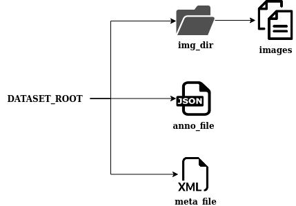

# IAPDataset
IAPDataset(Image Annotations Pairs Dataset) 是一种以图像-标注为单元的数据集工具，意在提供轻量、便捷和易用的数据集管理类。

```python
from iap import IAPDataset

# 读取数据集描述文件，加载数据集
A_set = IAPDataset('metadata.yml')

# 读取第一个数据
(image, annotation) = A_set.load_data(idx=0)

# 删除第一个数据
A_set.delete_data(name=annotation['name'])

# 添加数据，更新标注文件和数据集文件
A_set.add_data((image, annotation), state_update=True)
```

数据集包含图像和标注两类数据文件：图像数据置于文件夹 `img_path` 目录中，以文件命名为唯一标识。标注数据置于 `anno_file` 文件中，以字典形式存储所有图像数据对应的标注。

<div align="center">
  
</div>

### 数据集处理
IAPDataset 提供统一的接口用于对数据集进行的处理

```python
from iap import func_processor, if_processor
processors = []

# 使用自定义函数方式处理数据
def process_func(iap_data, **kwargs):
    do_something()
    if bad:
        # 返回 None 表示舍弃数据
        return None
    return iap_data
processors.append(func_processor(color_calibration, {}))

# 使用标注数据进行简单判断筛选
if_list = [lambda iap_data: iap_data[1]["height"] / iap_data[1]["width"] >= 1.5]
processors.append(if_processor(if_list))

# 处理数据集，生成新数据集 "clean"
A_set.pipeline('clean', processors)
```

### Todo
- [ ] 联合 pandas 管理标签
- [ ] 类型注释标准化
- [ ] 联合 CVGlue 自动化图像数据集清洗
- [ ] 功能重构
